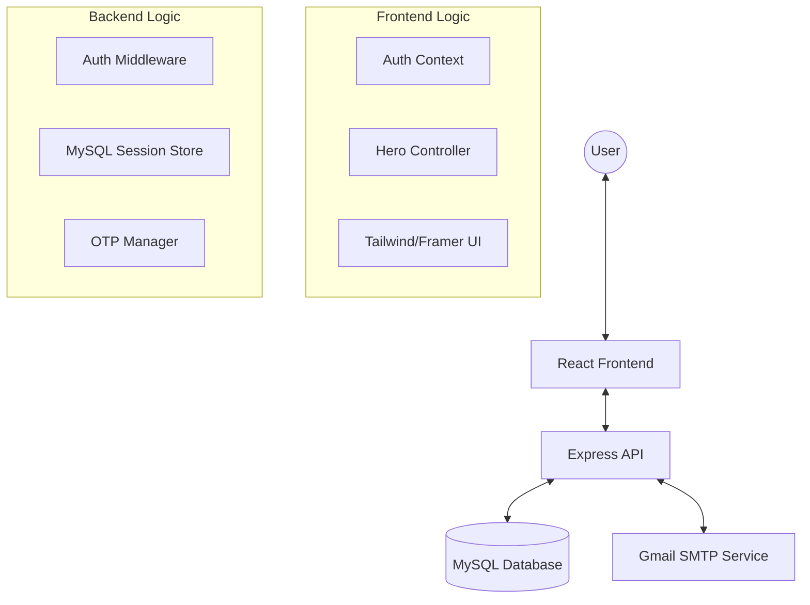

# 🍿 BINGESYNC: Premium Web Series Watchlist

BingeSync is a state-of-the-art web series discovery and social watchlist platform. Built with a focus on high-end aesthetics and seamless user interaction, it brings a cinematic experience to tracking your favorite shows and sharing them with friends.

---

## ✨ Key Features

### 🎬 Cinematic Hero Experience
- **Interactive Autoplay**: Trailers start seamlessly when you hover over the hero section, featuring a 2-second refined delay.
- **Visual Excellence**: Dynamic gradients, parallax depth, and high-resolution landscape artwork inspired by premium streaming platforms like Hotstar and Netflix.
- **Smart Transitions**: Smooth state changes between trailers and artwork using Framer Motion.

### 👥 Social Watchlist
- **Friend Connections**: Search, add, and manage friend requests.
- **Shared Discovery**: View your friends' watchlists and identify "Common Series" you both enjoy.
- **Real-time Notifications**: Get notified when you receive or accept friend requests.

### 🔐 Secure & Verified Auth
- **Email OTP Verification**: Registration flow secured via Gmail OTP (Nodemailer).
- **Session Persistence**: Secure session management using MySQL-backed session stores.

### 🔍 Discovery & Search
- **Dynamic Genre Filtering**: Seamlessly browse shows by Action, Comedy, Sci-Fi, and more.
- **Omni-Search**: Fast, real-time search functionality across the entire series database.

---

## 🛠 Tech Stack

### Frontend
- **Framework**: [React 19](https://react.dev/) (Vite)
- **Styling**: [Tailwind CSS 4](https://tailwindcss.com/)
- **Animations**: [Framer Motion](https://www.framer.com/motion/) & [GSAP](https://gsap.com/)
- **State Management**: React Context API
- **Icons**: [Lucide React](https://lucide.dev/)

### Backend
- **Runtime**: [Node.js](https://nodejs.org/)
- **Framework**: [Express.js 5](https://expressjs.com/)
- **Database**: [MySQL 8](https://www.mysql.com/)
- **Authentication**: `express-session` with `express-mysql-session`
- **Email Service**: [Nodemailer](https://nodemailer.com/) (Gmail SMTP)

---

## 🏗 System Architecture



---

## 🚀 Getting Started

### Prerequisites
- Node.js (v18+)
- MySQL Server
- Gmail App Password (for OTP)

### Installation

1. **Clone the entry**
   ```bash
   git clone <repository-url>
   cd Web_series_watchlist_with_friends
   ```

2. **Backend Setup**
   - Navigate to `backend/`
   - Run `npm install`
   - Create a `.env` file based on the following template:
     ```env
     DB_HOST=localhost
     DB_USER=root
     DB_NAME=watchlist
     DB_PASSWORD=your_password
     EMAIL=your_email@gmail.com
     EMAIL_PASS=your_app_password
     ```
   - Start the server: `node app.js`

3. **Frontend Setup**
   - Navigate to `frontend/`
   - Run `npm install`
   - Start the dev server: `npm run dev`

---

## 📁 Project Structure

```text
├── backend/
│   ├── config/          # Database configuration
│   ├── controllers/     # API request handlers
│   ├── routes/          # Express route definitions
│   ├── utils/           # Shared utility functions
│   └── app.js           # Main application entry
├── frontend/
│   ├── src/
│   │   ├── components/  # Reusable UI components
│   │   ├── pages/       # Page-level components
│   │   ├── context/     # Global state (Auth)
│   │   └── styles/      # Global CSS & Themes
└── README.md            # You are here!
```

---

## 📜 Author
**Saksham Hans**

